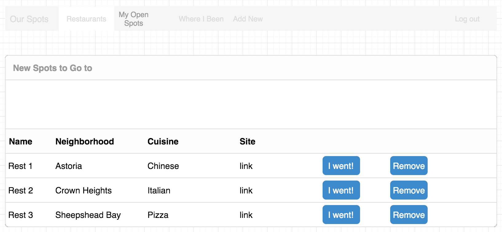
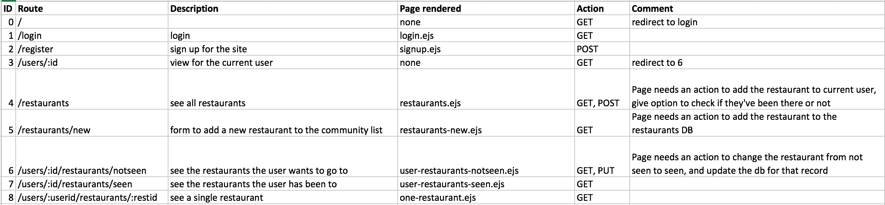

# Our Spots

## Overview

Our Spots is an application where a group can collectively monitor and keep track of the restaurants you may want to frequent. When you sign up, you will have access to a collective list of restaurants added to by the community. You can then add the restaurants you want to your page and keep track of them.

## Database Architecture (ERD)

## Wireframes

User landing page

Add a new restaurant

User's unvisited restaurants

User's frequented restaurants

## Routes

The following routes will need to be built.

